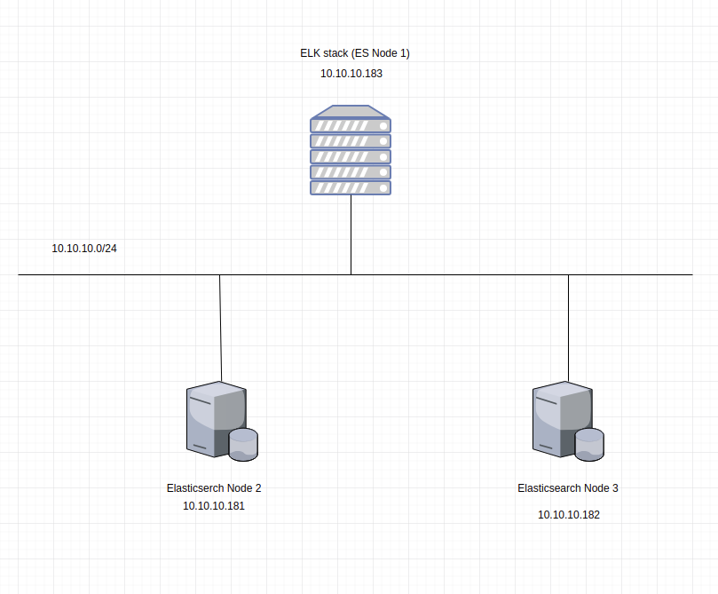

# ELK part 3 - Tìm hiểu về Elasticsearch.
## Lời mở đầu.#
- Ở Part 2 mình đã hướng dẫn cách để có thể cài đặt ELK với mô hình All in one và cách cấu hình trên client đẩy log về hệ thông ELK.

- Ở bài này mình sẽ giới thiệu về Elasticsearch một search engine sử dụng trong ELK stack ngoài là một search engine nó cũng là backend chính trong mô hình ELK stack, ngoài ra mình cũng giới thiệu cách để join cluster Elasticsearch phục vụ cho scale hệ thống backend của ELK stack mà không ảnh hưởng đến hoạt động của hệ thống.

1. Elasticsearch là gì?#
- Khái niệm về Elasticsearch thì đã có rất nhiều khi chúng ta tìm kiếm trên Google ở đây mình chỉ tổng hợp lại về Elasticsearch : Elasticsearch là một công cụ tìm kiếm và phân tích phân tán, là một RESTful mã nguồn mở được xây dựng trên Apache Lucene. Kể từ khi phát hành vào năm 2010 thì Elasticsearch đã nhanh chóng trở thành một trong những công cụ tìm kiếm được sử dụng thông dụng nhất và được sử dụng rộng rãi trong những trường hợp liên quan đến phân tích nhật ký và tìm kiếm văn bản, thông tin bảo mật và phân tích nghiệp vụ cũng như thông tin vận hành.
  

- Vì là một công cụ mã nguồn mở và miễn phí cho nên chúng ta có thể hoàn toàn cài đặt và sử dụng chỉ cần có một máy cài Linux.
  

## 2. Các khái niệm cơ bản của Elasticsearch.#


### 2.1. Document.#
- Là đơn vị nhỏ nhất để lưu trữ dữ liệu trong Elasticsearch. Đây là một đơn vị lưu trữ thông tin cơ bản trong Elasticsearch, là một JSON object đối với một số dữ liệu.
 
- Ví dụ : Chào mừng đến với 123job.vn
 
### 2.2. Index
- Trong Elasticsearch có một cấu trúc tìm kiếm gọi là inverted index, nó được thiết kế để cho phép tìm kiếm full-text search. Cách thức khá đơn giản, các văn bản được tách ra thành từng từ có nghĩa sau đó sẽ được map xem thuộc văn bản nào và khi search sẽ ra kết quả cụ thể.

- Có 2 kiểu đánh index và forward index và inverted index. Bản chất của inverted index là đánh theo keyword: words -> pages còn forward đánh theo nội dung page -> words.


Chúng ta có thể thấy viec đánh theo keyword thì việc tìm kiếm sẽ nhanh hơn việc chúng ta phải tìm kiếm theo từng page. Elasticsearch sử dụng Apache lucence để quản lý và tạo inverted index.

### 2.3. Shard
- Shard là một đối tượng của Lucence, là tập hợp con của một Index. Một index có thể được lưu trên nhiều shard.

- Một node bao gồm nhiều Shard, shard chính là đối tượng nhỏ nhât hoạt động ở mức thấp nhất, đóng vai trò lưu trữ dữ liệu.

- Chúng ta sẽ không bao giờ làm việc với các shard vì Elasticsearch sẽ hỗ trợ chúng ta toàn bộ việc giao tiếp cũng như tự động thay đổi các Shard khi cần thiết.

- Elasticsearch cung cấp 2 cơ chế của shard đó là primary shard và replica shard.

- Primary shard sẽ lưu trữ dữ liệu và đánh Index, sau khi đánh dữ liệu xong sẽ được vận chuyển đến các replica shard, mặc định của Elasticsearch mỗi index sẽ có 5 Primary shard thì sẽ đi kèm với 1 Replica shard.

- Replica shard là nơi lưu trữ dữ liệu nhân bản của Elasticsearch, đóng vai trò đảm bảo tính toàn vẹn dữ liệu khi Primary shard xảy ra vấn đề, ngoài ra nó còn giúp tăng tốc độ tìm kiếm vì chúng ta có thể cấu hình lượng Replica shard nhiều hơn cấu hình mặc định của Elasticsearch.

### 2.4. Node
- Là trung tâm hoạt động của Elasticsearch, là nơi lưu trữ dữ liệu, tham gia thực hiện đánh index của cluster cũng như thực hiện các thao tác tìm kiếm.

- Mỗi node được xác định bằng một tên riêng và không được phép trùng lặp.

### 2.5. Cluster


- Tập hợp các node hoạt động cùng với nhau, chia sẻ với nhau cùng một thuộc tính cluster name. Chính vì thế cluster sẽ được xác định bằng một tên riêng và không được phép trùng lặp. Việc tên của các cluster elasticsearch mà trùng nhai sẽ gây ra lỗi cho các node vì vậy khi cấu hình chúng ta cần phải chú ý.
  
- Mỗi cluster có một node chính gọi là master, node master được lựa chọn một cách tự động và có thể thay đổi nếu như có sự cố xảy ra. Một cluster có thể bao gồm nhiều nodes. Các nodes có thể hoạt động trên cùng một server. Tuy nhiên trên thực tế, một cluster sẽ gồm nhiều nodes hoạt động trên các server khác nhau để đảm bảo nếu một server gặp sự cố thì các node trên các server khác có thể hoạt động đầy đủ chức năng. Các node có thể tìm thấy nhau để hoạt động trên cùng 1 clustẻ thông qua giao thức Unicast.
  
> Chức năng chính của Cluster là quyết định xem shard nào được phân bổ cho node nào và khi nào thì di chuyển các Cluster để cần bằng lại Cluster.


## 3. Ưu điểm của Elasticsearch
- Có khả năng tìm kiếm và phân tích dữ liệu.
- Có khả năng mở rộng theo chiều ngang.
- Hỗ trợ tìm kiếm khi từ khóa tìm kiếm có thể bị lỗi.
- Hỗ trợ các Elasticsearch client như Java, Php, JS, Ruby,….

## 4. Nhược điểm của Elasticsearch.#
- Elasticsearch được thiết kế cho mục đích search cho nên khi sử dụng thì chúng ta nên sử dụng kèm theo một DB khac như MongoDB hay Mysql.
- Trong Elasticsearch không đảm bảo được toàn vẹn dữ liệu của các hoạt động như Insert, Update hay Delete.
- Không thích hợp với những hệ thống thường xuyên cập nhật dữ liệu. Sẽ rất tốn kém cho việc đánh index dữ liệu.
  

# Hướng dẫn join cluster Elasticsearch.#
Bài toán đặt ra là chúng ta đang có một hệ thống ELK stack đang sử dụng Elasticsearch và lượng dữ liệu phình to lên và đang có nhu cầu mở rộng Elasticsearch để tăng khả năng lưu trữ và tìm kiếm mà không ảnh hưởng đến họat động của hệ thống.

## Mô hình triển khai


## Phân hoạch địa chỉ IP


## Các bước cài đặt
Cài đặt Elasticsearch trên 2 node muốn join cluster.

Disable IPv6 :
```
cat > /etc/sysctl.conf << EOF
net.ipv6.conf.all.disable_ipv6 = 1
net.ipv6.conf.default.disable_ipv6 = 1
net.ipv6.conf.lo.disable_ipv6 = 1
EOF

sysctl -p
```

Cài đặt java và wget :
```
yum install java-1.8.0-openjdk.x86_64 wget -y
```

Tải bản cài đặt Elasticsearch :
```
wget https://download.elastic.co/elasticsearch/elasticsearch/elasticsearch-1.7.3.noarch.rpm
```

Cài đặt Elasticsearch :
```
rpm -ivh elasticsearch-1.7.3.noarch.rpm
```

Khởi động Elasticsearch và cho phép khởi động cùng máy chủ :
```
systemctl start elasticsearch
systemctl enable elasticsearch
```

Cấu hình elasticsearch trên node ELK


Mở file cấu hình

```
vi /etc/elasticsearch/elasticsearch.yml
```
Chỉnh sửa lại các cấu hình như sau :

```
cluster.name: cloud365
node.name: "Node1"
node.master: true
path.data: /var/lib/elasticsearch
path.logs: /var/log/elasticsearch
network.host: 0.0.0.0
http.port: 9200
discovery.zen.ping.unicast.hosts: ["10.10.10.183", "10.10.10.181", "10.10.10.182"]
discovery.zen.minimum_master_nodes: 2
```

Để tránh hiện tượng split brain chúng ta nên để thông số discovery.zen.minimum_master_nodes theo công thức : Tổng số node / 2 + 1


Cấu hình trên 2 node muốn join vào cluster

Mở file cấu hình :

```
vi /etc/elasticsearch/elasticsearch.yml
```

Sửa lại cấu hình trên 2 node như sau:
```
cluster.name: cloud365
node.name: "Node2" # Node 2 hay Node 3 như trên mô hình
path.data: /var/lib/elasticsearch
path.logs: /var/log/elasticsearch
network.host: 0.0.0.0
http.port: 9200
discovery.zen.ping.unicast.hosts: ["10.10.10.183", "10.10.10.181", "10.10.10.182"]
discovery.zen.minimum_master_nodes: 2
```

> Restart Elasticsearch trên các node.

Kiểm tra kết quả.#

Đứng trên node bất kỳ gọi đến một node trong cluster xem cluster đã được join hay chưa:
```
curl http://10.10.10.181:9200/_cluster/health?pretty
```
Kết quả :

```
[root@Cloud365 ~]# curl http://10.10.10.181:9200/_cluster/health?pretty
{
  "cluster_name" : "cloud365",
  "status" : "green",
  "timed_out" : false,
  "number_of_nodes" : 3,
  "number_of_data_nodes" : 3,
  "active_primary_shards" : 0,
  "active_shards" : 0,
  "relocating_shards" : 0,
  "initializing_shards" : 0,
  "unassigned_shards" : 0,
  "delayed_unassigned_shards" : 0,
  "number_of_pending_tasks" : 0,
  "number_of_in_flight_fetch" : 0
}
```

Check các node trong cluster :
```
curl -XGET 'http://10.10.10.181:9200/_cluster/state?pretty' | less
```

Kết quả :

```
100   924  100   924    0     0  45132      0 --:--:-- --:--:-- --:--:-- 46200
{
  "cluster_name" : "cloud365",
  "version" : 4,
  "master_node" : "lLtteXggSyGxygvtJ9N7Zw",
  "blocks" : { },
  "nodes" : {
    "VYfyWZ8hToeeLKs4fXm69g" : {
      "name" : "Hildegarde",
      "transport_address" : "inet[/10.10.10.181:9300]",
      "attributes" : { }
    },
    "lLtteXggSyGxygvtJ9N7Zw" : {
      "name" : "Node1",
      "transport_address" : "inet[/10.10.10.183:9300]",
      "attributes" : {
        "master" : "true"
      }
    },
    "T7KaZyfvRZq6D_72Xjf6Nw" : {
      "name" : "Node3",
      "transport_address" : "inet[/10.10.10.182:9300]",
      "attributes" : { }
    }
  },
  "metadata" : {
    "templates" : { },
    "indices" : { }
  },
  "routing_table" : {
    "indices" : { }
  },
  "routing_nodes" : {
    "unassigned" : [ ],
    "nodes" : {
      "VYfyWZ8hToeeLKs4fXm69g" : [ ],
      "lLtteXggSyGxygvtJ9N7Zw" : [ ],
      "T7KaZyfvRZq6D_72Xjf6Nw" : [ ]
    }
  },
  "allocations" : [ ]
}
(END)
```

## Tổng kết

Như vậy ở bài này mình đã tổng quan về Elasticsearch và hướng dẫn cài đặt Elasticsearch cluster nhằm mục tiêu mong muốn tăng hiệu năng tìm kiếm cũng như khi cần scale backend để đảm bảo được lượng dữ liệu phình to lên.


